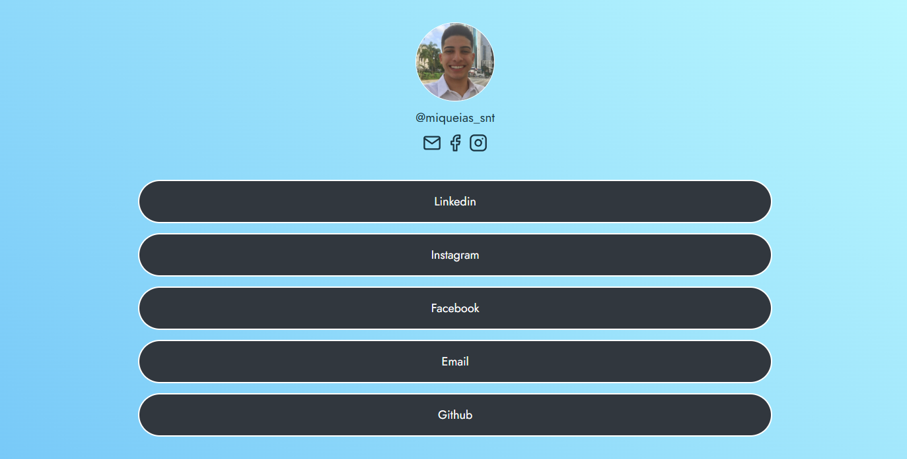

<h1 align="center"> Links Page </h1>

  O Links Page é uma página criada para você que precisa divulgar diversos links de forma prática e centralizada.

  <a href="#-tecnologias">Tecnologias</a>&nbsp;&nbsp;&nbsp;|&nbsp;&nbsp;&nbsp;
  <a href="#-projeto">Projeto</a>&nbsp;&nbsp;&nbsp;|&nbsp;&nbsp;&nbsp;
  <a href="#-layout">Layout</a>&nbsp;&nbsp;&nbsp;|&nbsp;&nbsp;&nbsp;
  <a href="#memo-licença">Licença</a>

  

 

  

## 🚀 Tecnologias

Esse projeto foi desenvolvido com as seguintes tecnologias:

- HTML5
- CSS3

## 💻 Projeto

O **Links Page** atua como um cartão de visitas digital. Ele resolve o problema da bio do Instagram (que só aceita um link), permitindo que você agrupe suas redes sociais (LinkedIn, Facebook, Instagram) e contato por e-mail em uma única landing page responsiva e agradável.

- [Acesse o projeto online]([https://miqueiassantoss.github.io/LinksPage/])

## 🔖 Layout

O layout foi pensado para ser mobile-first, garantindo boa visualização em dispositivos móveis, mas adaptando-se para desktops através de Media Queries.

## 📝 Licença

Esse projeto está sob a licença MIT. Veja o arquivo [LICENSE](LICENSE) para mais detalhes.

---

Feito com ♥ por [Miqueias Santos](https://github.com/miqueiassantoss)